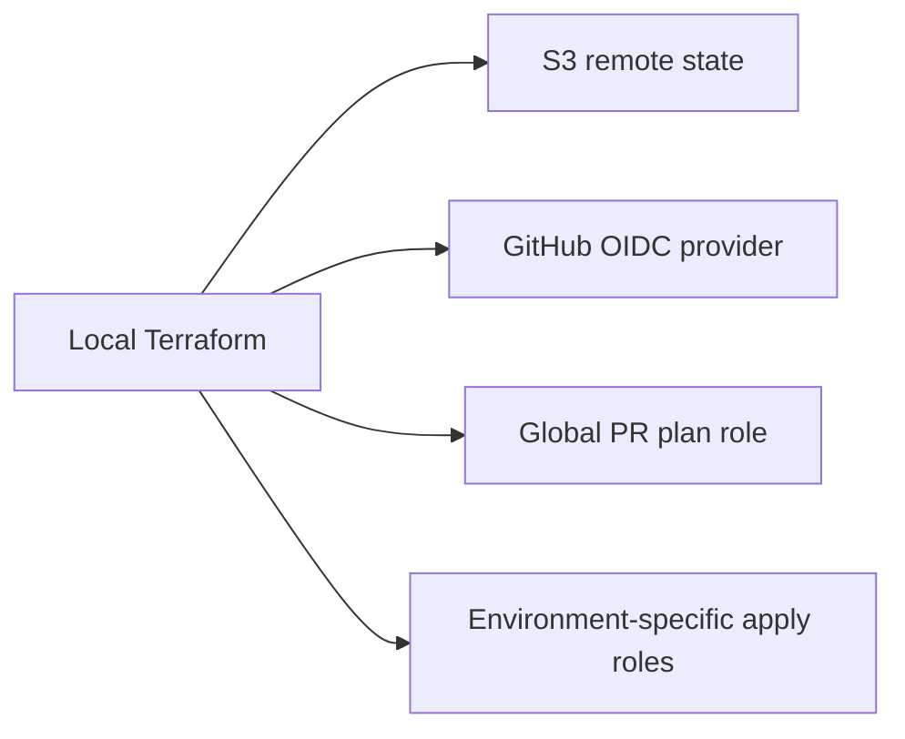

# Bootstrap Terraform

Shared Terraform root for state, GitHub OIDC, and CI identities used by the AWS stacks in `infra/`.

## Architecture

Bootstrap is run locally. First run creates the state bucket and IAM setup. After that, the same root uses S3 remote state.



## Resources

- S3 bucket for Terraform remote state
- GitHub OIDC provider
- Global GitHub Actions plan role for pull requests
- Environment-specific GitHub Actions apply roles for `dev`, `stage`, and `prod`

## Ownership

Bootstrap owns shared platform pieces:

- state bucket
- OIDC provider
- CI identities used by GitHub Actions

Workload stacks own their own application resources and any workload-specific deploy permissions.

## Deploy

First local run:

```sh
cd infra/bootstrap/terraform
terraform init -backend=false
terraform apply
terraform init -reconfigure -migrate-state
```

Normal local runs after migration:

```sh
cd infra/bootstrap/terraform
terraform init -input=false
terraform plan
terraform apply
```

Set GitHub variables from outputs:

```sh
terraform output -raw github_actions_plan_role_arn
terraform output -json ecs_fargate_github_actions_apply_role_arns
```

Use them as:

- repository variable: `AWS_TERRAFORM_PLAN_ROLE_ARN`
- environment variable: `AWS_ECS_FARGATE_TERRAFORM_APPLY_ROLE_ARN`

## Destroy

Destroy workload stacks first.

Bootstrap is a manual local teardown because it owns the remote-state bucket and shared CI access. Move bootstrap state off S3 before final destroy, then run:

```sh
terraform destroy
```
