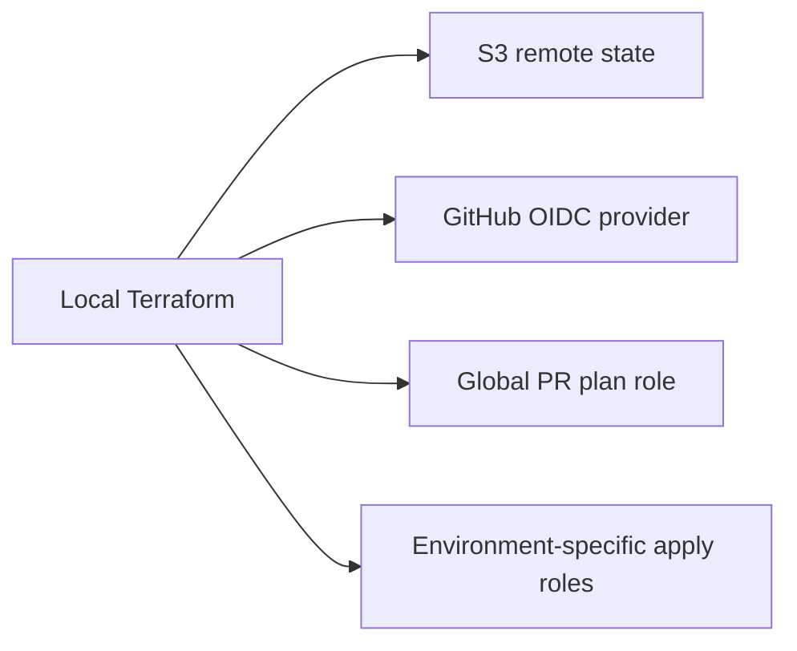

# Bootstrap Terraform

Shared Terraform root for remote state, GitHub OIDC, and the CI roles used by the AWS stacks in `infra/`.

## Architecture

Run bootstrap locally. The first run creates the state bucket and IAM setup. After that, the same root uses S3 remote state.



## Resources

- S3 bucket for Terraform remote state
- GitHub OIDC provider
- Global GitHub Actions plan role for pull requests
- Environment-specific GitHub Actions apply roles for `dev`, `stage`, and `prod`

## IAM and OIDC

The OIDC provider is `https://token.actions.githubusercontent.com` with `sts.amazonaws.com` as the client ID.

Trust policy scope:

- PR plan role: `repo:<repository>:pull_request`
- Apply roles: `repo:<repository>:environment:<environment>`

Permission scope:

- the PR plan role is read-only
- the apply roles are split per stack and environment
- the apply roles are limited by state path and workload naming patterns, but they still need broad service permissions for Terraform create, update, and delete operations

## Ownership

Bootstrap owns the shared pieces:

- state bucket
- OIDC provider
- CI identities used by GitHub Actions

Workload stacks own their own application resources and workload-specific deploy permissions.

## Deploy

First local run:

```sh
cd infra/bootstrap/terraform
terraform init -backend=false
terraform apply
terraform init -reconfigure -migrate-state
```

Normal local runs after migration:

```sh
cd infra/bootstrap/terraform
terraform init -input=false
terraform plan
terraform apply
```

Set GitHub role variables from outputs:

```sh
terraform output -raw github_actions_plan_role_arn
terraform output -json ecs_fargate_github_actions_apply_role_arns
terraform output -json ecs_ec2_github_actions_apply_role_arns
```

Set these GitHub variables:

- repository variable: `TERRAFORM_STATE_BUCKET` = the bootstrap state bucket name (`var.state_bucket_name`, default `455394301478-terraform-state-s3`)
- repository variable: `AWS_TERRAFORM_PLAN_ROLE_ARN`
- environment variable: `AWS_ECS_FARGATE_TERRAFORM_APPLY_ROLE_ARN`
- environment variable: `AWS_ECS_EC2_TERRAFORM_APPLY_ROLE_ARN`

Bootstrap creates roles for `dev`, `stage`, and `prod`, but the current ECS deploy and PR-check workflows only expose `dev`.

## Destroy

Destroy workload stacks first.

Bootstrap teardown is manual because it owns the remote-state bucket and shared CI access. Move bootstrap state off S3 before the final destroy, then run:

```sh
terraform destroy
```
