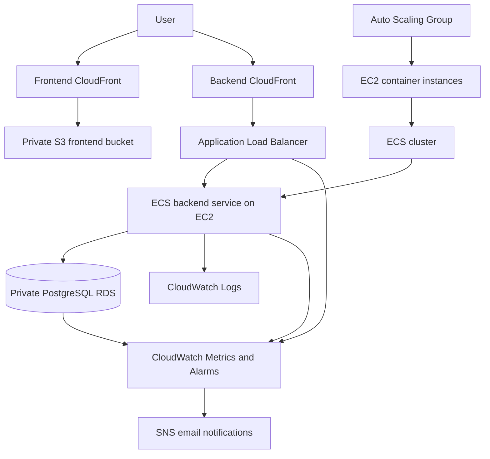
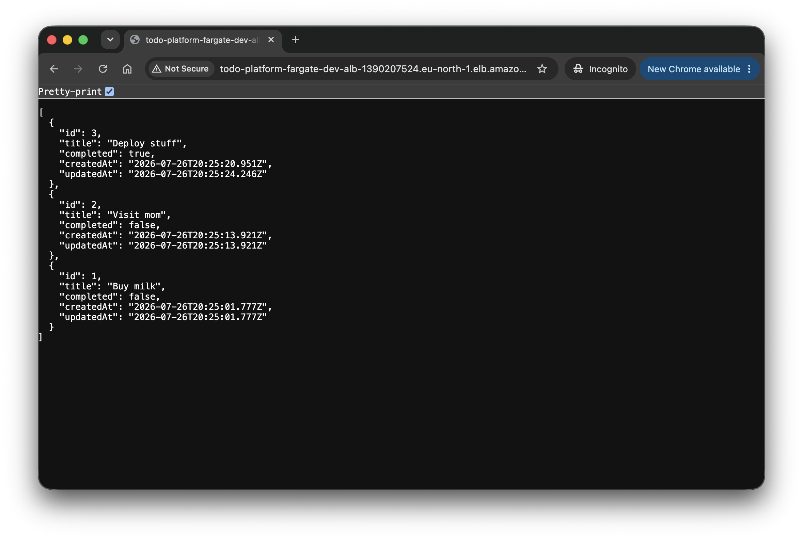

# ECS EC2 Terraform

Terraform stack for running the todo application on Amazon ECS using EC2 capacity.

The stack contains a static frontend hosted in S3, separate CloudFront distributions for the frontend and backend, an Application Load Balancer, an ECS backend service, EC2 container instances, a private PostgreSQL database, deployment roles, logging, monitoring, alarm notifications, and automatic rollback for failed ECS deployments.

GitHub Actions is the normal way to plan, deploy, and destroy the environment. Local Terraform commands are mainly used for debugging.

## Architecture



The Application Load Balancer runs in public subnets but only accepts traffic from the AWS-managed CloudFront origin-facing prefix list.

The ECS container instances and backend tasks run in private subnets and use NAT gateways for outbound traffic.

The frontend is deployed as static files to a private S3 bucket and served through CloudFront.

The backend is exposed through a separate CloudFront distribution that forwards API traffic to the ALB.

RDS runs in separate private database subnets and is only reachable from the backend security group.




## Main resources

- VPC across two availability zones
- Public, private, and database subnets
- Internet gateway and NAT gateways
- Application Load Balancer
- Backend target group
- ECS cluster using EC2 capacity
- Auto Scaling Group with two ECS container instances
- ECS capacity provider
- ECS backend service
- ECS deployment circuit breaker with rollback
- Backend ECR repository
- One-off backend migration task definition
- Private PostgreSQL RDS instance
- Secrets Manager managed database credentials
- Private S3 frontend bucket
- Frontend CloudFront distribution
- Backend CloudFront distribution
- CloudWatch log group
- CloudWatch dashboard and alarms
- SNS email notifications
- IAM roles and policies for ECS and GitHub Actions

## Traffic flow

Frontend traffic follows this path:

```text
User → Frontend CloudFront → Private S3 bucket
```

Backend traffic follows this path:

```text
User → Backend CloudFront → ALB → ECS backend → RDS
```

The frontend calls the backend API through:

```text
https://<backend-cloudfront-domain>/api
```

CloudFront forwards backend requests to the ALB over HTTP.

The ALB forwards requests to ECS backend tasks on port `3001`.

The backend connects to PostgreSQL on port `5432`.

Security group access is limited to:

```text
CloudFront origin-facing network → ALB
ALB → backend tasks
Backend tasks → RDS
```

The ECS container instances, ECS tasks, and RDS instance do not have public IP addresses.

The ALB is internet-facing because it is used as a CloudFront custom origin, but ordinary internet clients cannot connect to it through its security group.

## Deployment

GitHub Actions uses AWS OIDC instead of long-lived AWS access keys.

Pull requests use a read-only Terraform plan role.

Deployments use an environment-specific apply role for:

- `dev`
- `stage`
- `prod`

The main workflows are:

- PR checks: `.github/workflows/ecs-ec2-pr-check.yml`
- Deploy: `.github/workflows/ecs-ec2-deploy.yml`
- Destroy: `.github/workflows/ecs-ec2-destroy.yml`

The deploy workflow contains separate jobs for:

- Infrastructure
- Backend
- Frontend

The infrastructure job initially creates the ECS service with a desired count of zero.

This prevents ECS from trying to start backend tasks before the first application image has been pushed to ECR.

The backend deployment then:

1. Builds the backend Docker image.
2. Pushes the image to ECR using the Git commit SHA as an immutable tag.
3. Registers a new backend task definition revision.
4. Registers a matching migration task definition revision.
5. Runs the database migration as a one-off ECS task.
6. Updates the ECS backend service.
7. Scales the service to two tasks.
8. Waits for the ECS service to reach a stable state.

The frontend deployment then:

1. Reads the backend CloudFront domain from Terraform outputs.
2. Builds the shared and frontend packages.
3. Configures the frontend API URL.
4. Writes and validates the runtime configuration.
5. Assumes the dedicated frontend deployment role.
6. Synchronizes the frontend build to S3.
7. Invalidates the frontend CloudFront distribution.

Terraform creates the initial ECS task definitions. Later application deployments manage new task definition revisions and the active desired task count.

The deployment workflow waits for the backend ECS service to reach a stable state:

```sh
aws ecs wait services-stable
```

If the service fails to stabilize, the workflow exits with an error.

## Deployment rollback

The ECS backend service uses the deployment circuit breaker with automatic rollback enabled.

During a rolling deployment, ECS starts and validates the new backend tasks against the ALB target group health check.

The backend target group checks the `/health` endpoint and expects an HTTP `200` response.

If a new task repeatedly fails to start or does not pass its health check:

1. The target is marked unhealthy.
2. ECS stops the failed task and retries the deployment.
3. The circuit breaker eventually marks the deployment as failed.
4. ECS stops deploying the broken revision.
5. The previous stable task definition remains active or is restored.

The ECS EC2 service currently uses:

```text
Minimum healthy percentage: 50%
Maximum percentage: 150%
```

Rollback behavior was not tested separately in this lab because the same ECS circuit-breaker behavior was already verified in the ECS Fargate lab.

## Terraform state

Bootstrap and workload infrastructure use separate Terraform states.

`infra/bootstrap/terraform` owns:

- Terraform state bucket
- GitHub OIDC provider
- Terraform plan role
- Environment-specific apply roles

`infra/ecs-ec2/terraform` owns:

- Networking
- Application Load Balancer
- ECS cluster and service
- EC2 launch template
- Auto Scaling Group
- ECS capacity provider
- ECR repository
- S3 frontend bucket
- CloudFront distributions
- RDS
- CloudWatch resources
- SNS topic
- Workload IAM roles and policies

Destroying the ECS EC2 stack does not destroy the bootstrap resources or the Terraform state bucket.

## Observability

Backend application and migration logs are sent to CloudWatch Logs.

Separate log streams are created for:

- Backend
- Backend migrations

Logs are retained for 14 days.

The CloudWatch dashboard includes:

- ECS CPU utilization
- ECS memory utilization
- ALB target 5XX responses
- ALB unhealthy targets
- ALB target response time
- RDS CPU utilization
- RDS database connections
- RDS free storage
- Current alarm status

CloudWatch alarms send notifications through an SNS email subscription.

The unhealthy-target metric can also show failed deployment attempts while ECS starts and validates new tasks.

ECS deployment details and rollback progress are available through the service deployment timeline and service events.

## Security

The stack includes several basic security controls:

- GitHub Actions authenticates through OIDC
- No permanent AWS credentials are stored in GitHub
- The frontend S3 bucket blocks public access
- CloudFront uses Origin Access Control to access frontend objects
- The ALB only accepts traffic from the CloudFront origin-facing prefix list
- Backend tasks only accept traffic from the ALB security group
- RDS is not publicly accessible
- Database credentials are managed by AWS Secrets Manager
- The backend task role can only read the specific database secret
- EC2 container instances run in private subnets
- ECS tasks run in private subnets without public IP addresses
- EC2 Instance Metadata Service requires IMDSv2
- ECR image scanning is enabled
- ECR uses immutable image tags
- The frontend deployment role is restricted to the frontend S3 bucket and CloudFront distribution
- `iam:PassRole` is restricted to the ECS execution and backend task roles
- `iam:PassRole` can only be used with `ecs-tasks.amazonaws.com`

The frontend and backend use separate CloudFront domains.

The backend task receives the frontend CloudFront domain through:

```text
CORS_ORIGIN=https://<frontend-cloudfront-domain>
```

This allows the backend to explicitly permit browser requests from the deployed frontend.

The backend CloudFront distribution provides HTTPS to clients.

CloudFront currently connects to the ALB over HTTP.

## ECS EC2 capacity

The ECS cluster uses an Auto Scaling Group backed by an ECS-optimized Amazon Linux 2023 launch template.

The latest recommended ECS-optimized AMI is resolved from AWS Systems Manager Parameter Store.

The current capacity configuration is:

```text
Minimum instances: 2
Desired instances: 2
Maximum instances: 2
```

The ECS capacity provider uses the Auto Scaling Group, but managed scaling is intentionally disabled.

This keeps EC2 capacity fixed so that ECS task placement, ENI availability, deployment percentages, and instance capacity can be studied directly.

The EC2 instances register with the ECS cluster through launch-template user data:

```sh
echo "ECS_CLUSTER=${cluster_name}" >> /etc/ecs/ecs.config
```

## Local commands

Local Terraform commands can be run through the helper script:

```sh
cd infra/ecs-ec2

../../tools/tf.sh --env dev fmt
../../tools/tf.sh --env dev validate

../../tools/tf.sh --env dev plan \
  -var backend_image_tag=bootstrap

../../tools/tf.sh --env dev apply \
  -var backend_image_tag=bootstrap
```

The SNS email is normally provided through GitHub Actions as a Terraform variable.

The infrastructure workflow also sets:

```text
backend_desired_count = 0
```

during bootstrap so that no task starts before the backend image exists.

## Verify

Get the frontend CloudFront domain:

```sh
terraform -chdir=terraform output -raw frontend_cloudfront_domain_name
```

Get the backend CloudFront domain:

```sh
terraform -chdir=terraform output -raw backend_cloudfront_domain_name
```

Get the ALB address:

```sh
terraform -chdir=terraform output -raw alb_dns_name
```

Check backend logs:

```sh
aws logs tail "/ecs/ecs-ec2-dev/backend" \
  --region eu-north-1 \
  --follow
```

The CloudWatch dashboard is named:

```text
ecs-ec2-dev-dashboard
```

Verify the backend through CloudFront:

```sh
curl -i \
  "https://$(terraform -chdir=terraform output -raw backend_cloudfront_domain_name)/health"
```

Verify the API:

```sh
curl -i \
  "https://$(terraform -chdir=terraform output -raw backend_cloudfront_domain_name)/api/todos"
```

A successful deployment should end with:

- The frontend available through CloudFront
- The backend API available through CloudFront
- Two registered ECS container instances
- Two running backend tasks
- Healthy targets in the backend target group
- A stable ECS backend service
- Successful database migrations
- No active CloudWatch alarms
- The latest task definition revision running

The lab verified a complete delete request through CloudFront:

```text
HTTP/2 204
x-cache: Miss from cloudfront
```

This confirmed the complete request path:

```text
Client
→ Backend CloudFront
→ Application Load Balancer
→ ECS backend task
→ PostgreSQL RDS
```

Direct access to the frontend S3 bucket should be blocked.

Direct access to the ALB from an ordinary internet client should also be blocked by the ALB security group.

## Destroy

The normal destroy path is the GitHub Actions destroy workflow.

For a controlled local teardown:

```sh
cd infra/ecs-ec2

../../tools/tf.sh --env dev destroy \
  -var backend_image_tag=bootstrap
```

This destroys the workload environment but keeps the shared bootstrap infrastructure and Terraform state bucket.

The stack creates resources that may generate ongoing AWS charges, including:

- Two EC2 instances
- Two NAT gateways
- RDS
- Application Load Balancer
- Two CloudFront distributions
- Elastic IP addresses
- CloudWatch alarms and dashboard

The environment should be destroyed when it is not actively being used.
