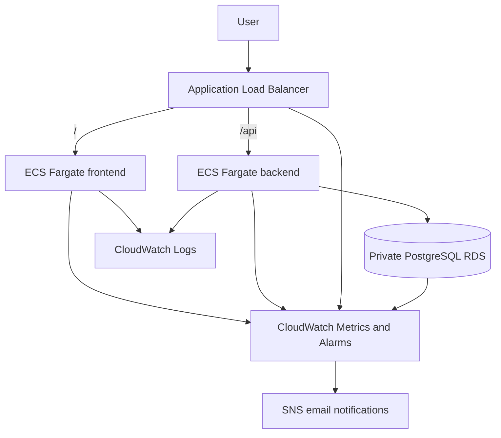

# ECS Fargate Terraform

Terraform stack for running the todo application on AWS ECS Fargate.

The stack contains a frontend service, backend service, private PostgreSQL database, load balancer, deployment roles, logging, monitoring, and alarm notifications.

GitHub Actions is the normal way to plan, deploy, and destroy the environment. Local Terraform commands are mainly used for debugging.

## Architecture



The ALB runs in public subnets.

The frontend and backend ECS services run in private subnets and use NAT gateways for outbound traffic.

The frontend is intentionally deployed as a separate ECS service in this lab to practice running multiple services behind one ALB. For a simple static SPA, S3 and CloudFront would normally be a better fit.

RDS runs in separate private database subnets and is only reachable from the backend security group.

## Main resources

- VPC across two availability zones
- Public, private, and database subnets
- Internet gateway and NAT gateways
- Application Load Balancer
- Frontend and backend target groups
- ECS Fargate cluster and services
- Frontend and backend ECR repositories
- One-off backend migration task definition
- Private PostgreSQL RDS instance
- Secrets Manager managed database credentials
- CloudWatch log groups
- CloudWatch dashboard and alarms
- SNS email notifications
- IAM roles and policies for ECS and GitHub Actions

## Traffic flow

Requests to the ALB are routed by path:

- `/` goes to the frontend ECS service
- `/api` and `/api/*` go to the backend ECS service

The backend connects to PostgreSQL on port `5432`.

Security group access is limited to:

```text
Internet → ALB
ALB → frontend and backend
Backend → RDS
```

The ECS tasks and RDS instance do not have public IP addresses.

## Deployment

GitHub Actions uses AWS OIDC instead of long-lived AWS access keys.

Pull requests use a read-only Terraform plan role.

Deployments use an environment-specific apply role for:

- `dev`
- `stage`
- `prod`

The main workflows are:

- PR checks: `.github/workflows/ecs-fargate-pr-check.yml`
- Deploy: `.github/workflows/ecs-fargate-deploy.yml`
- Destroy: `.github/workflows/ecs-fargate-destroy.yml`

The deployment process builds the application images, pushes them to ECR, runs database migrations, and updates the ECS services.

Terraform creates the initial ECS task definitions. Later application deployments manage new task definition revisions.

## Terraform state

Bootstrap and workload infrastructure use separate Terraform states.

`infra/bootstrap/terraform` owns:

- Terraform state bucket
- GitHub OIDC provider
- Terraform plan role
- Environment-specific apply roles

`infra/ecs-fargate/terraform` owns:

- Networking
- ALB
- ECS services
- ECR repositories
- RDS
- CloudWatch resources
- SNS topic
- Workload IAM roles and policies

Destroying the ECS Fargate stack does not destroy the bootstrap resources or the state bucket.

## Observability

Application logs are sent to CloudWatch Logs.

Separate log streams are created for:

- Frontend
- Backend
- Backend migrations

Logs are retained for 14 days.

The CloudWatch dashboard includes:

- ECS CPU utilization
- ECS memory utilization
- ALB target 5XX responses
- ALB unhealthy targets
- ALB target response time
- RDS CPU utilization
- RDS database connections
- RDS free storage
- Current alarm status

CloudWatch alarms send notifications through an SNS email subscription.

## Security

The stack includes several basic security controls:

- GitHub Actions authenticates through OIDC
- No permanent AWS credentials are stored in GitHub
- RDS is not publicly accessible
- Database credentials are managed by AWS Secrets Manager
- The backend task role can read the database secret
- The frontend task has no database access
- The state bucket blocks public access
- State bucket versioning and encryption are enabled
- HTTP access to the state bucket is denied
- ECR image scanning is enabled
- ECR repositories use immutable image tags

HTTPS for the application ALB is not configured yet.

## Local commands

Local Terraform commands can be run through the helper script:

```sh
cd infra/ecs-fargate

../../scripts/tf-ecs.sh dev fmt
../../scripts/tf-ecs.sh dev validate

../../scripts/tf-ecs.sh dev plan \
  -var frontend_image_tag=bootstrap \
  -var backend_image_tag=bootstrap

../../scripts/tf-ecs.sh dev apply \
  -var frontend_image_tag=bootstrap \
  -var backend_image_tag=bootstrap
```

The SNS email is normally provided through GitHub Actions as a Terraform variable.

## Verify

Get the ALB address:

```sh
terraform -chdir=terraform output -raw alb_dns_name
```

Check backend logs:

```sh
aws logs tail "/ecs/ecs-fargate-dev/backend" \
  --region eu-north-1 \
  --follow
```

Check frontend logs:

```sh
aws logs tail "/ecs/ecs-fargate-dev/frontend" \
  --region eu-north-1 \
  --follow
```

The CloudWatch dashboard is named:

```text
ecs-fargate-dev-dashboard
```

## Destroy

The normal destroy path is the GitHub Actions destroy workflow.

For a controlled local teardown:

```sh
cd infra/ecs-fargate

../../scripts/tf-ecs.sh dev destroy \
  -var frontend_image_tag=bootstrap \
  -var backend_image_tag=bootstrap
```

This destroys the workload environment but keeps the shared bootstrap infrastructure and Terraform state bucket.
