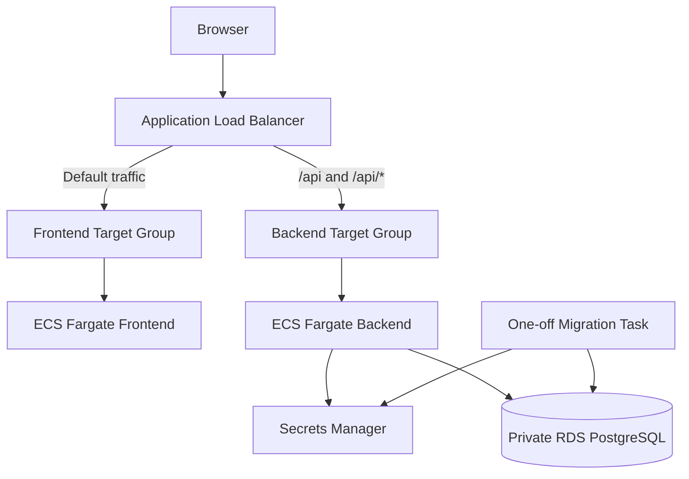

# AWS ECS Fargate and Private RDS with Terraform

AWS ECS Fargate lab built with Terraform for a full-stack Todo app behind an Application Load Balancer with a private PostgreSQL RDS database.

## Architecture

This diagram shows the request path from the public ALB to the private frontend, backend, and database.



## Resources

- VPC: `10.0.0.0/16`
- Two Availability Zones
- Two public subnets
- Two private ECS subnets
- Two isolated DB subnets
- Internet Gateway
- One NAT Gateway per Availability Zone
- Public Application Load Balancer
- Frontend and backend target groups
- ALB listener on port `80`
- Path routing for `/api` and `/api/*`
- ECS Fargate frontend service
- ECS Fargate backend service
- Private PostgreSQL RDS instance
- RDS subnet group
- RDS-managed credentials in Secrets Manager
- ECS execution role
- Backend task role
- One-off ECS task for database migrations
- ECR repositories for frontend and backend
- CloudWatch log groups

## Network paths

```text
Browser
  -> Application Load Balancer
  -> Frontend Target Group
  -> Private Frontend Task
```

```text
Browser
  -> Application Load Balancer
  -> Backend Target Group
  -> Private Backend Task
  -> Private RDS
```

The ECS tasks run in private subnets without public IP addresses.

They use NAT Gateways for outbound access such as ECR image pulls, CloudWatch logging, and Secrets Manager requests.

The DB subnets have no route to the internet.

## Security groups

```text
0.0.0.0/0 -> ALB tcp/80
ALB security group -> frontend tcp/80
ALB security group -> backend tcp/3001
backend security group -> RDS tcp/5432
```

The frontend and backend only accept traffic from the ALB security group.

RDS only accepts PostgreSQL traffic from the backend security group.

## Database access

Local development uses `DATABASE_URL`.

On ECS, the backend receives:

```text
DB_SECRET_ARN
DB_HOST
DB_PORT
DB_NAME
```

The backend task role can read only the specific RDS secret.

The application reads the username and password from Secrets Manager and builds the database connection URL in memory.

The full connection URL and password are not stored in Terraform or logged by the application.

This lab uses the RDS master credential to keep the scope focused on ECS, IAM, Secrets Manager, private networking, and RDS. A production application should use a separate restricted database role.

## Database migrations

Database migrations run as a separate one-off Fargate task using the same backend image as the API.

```text
Build backend image
  -> Update migration task definition
  -> Run migration task
  -> Verify exit code 0
  -> Deploy backend service
```

The migration task:

- runs inside the private ECS subnets
- uses the backend task role
- can reach the private RDS instance
- is not connected to the ALB
- has no ECS service
- exits after the migration finishes

The migration runs before the new backend version receives traffic.

## What I learned

- How to run frontend and backend Fargate tasks in private subnets
- Why Fargate target groups use `target_type = "ip"`
- How ALB path routing can expose a frontend and API through one entrypoint
- How security-group references restrict traffic between ALB, ECS, and RDS
- How an ECS task role can read a specific Secrets Manager secret
- Why private ECS tasks need NAT Gateways or VPC endpoints for outbound access
- Why database migrations should run before a new backend version receives traffic
- How the same backend image can run both the API and a one-off migration task

## Run

From `infra/ecs-fargate`:

```sh
../../tools/tf.sh fmt
../../tools/tf.sh validate
```

Create the ECR repositories before pushing the first images:

```sh
../../tools/tf.sh apply \
  -target=aws_ecr_repository.frontend \
  -target=aws_ecr_lifecycle_policy.frontend \
  -target=aws_ecr_repository.backend \
  -target=aws_ecr_lifecycle_policy.backend \
  -var environment=dev \
  -var frontend_image_tag=bootstrap \
  -var backend_image_tag=bootstrap
```

Login to ECR:

```sh
FRONTEND_REPO="$(terraform -chdir=terraform output -raw frontend_ecr_repository_url)"
BACKEND_REPO="$(terraform -chdir=terraform output -raw backend_ecr_repository_url)"
REGISTRY_HOST="$(printf '%s\n' "$BACKEND_REPO" | cut -d/ -f1)"

aws ecr get-login-password --region eu-north-1 \
  | docker login --username AWS --password-stdin "$REGISTRY_HOST"
```

Build and push the frontend:

```sh
docker build \
  -f ../../apps/todo/frontend/Dockerfile \
  -t "$FRONTEND_REPO:v1" \
  ../../apps/todo

docker push "$FRONTEND_REPO:v1"
```

Build and push the backend:

```sh
docker build \
  -f ../../apps/todo/backend/Dockerfile \
  -t "$BACKEND_REPO:v1" \
  ../../apps/todo

docker push "$BACKEND_REPO:v1"
```

Create the infrastructure without starting the ECS services:

```sh
../../tools/tf.sh plan \
  -var environment=dev \
  -var frontend_image_tag=v1 \
  -var backend_image_tag=v1 \
  -var backend_migration_image_tag=v1 \
  -var frontend_desired_count=0 \
  -var backend_desired_count=0

../../tools/tf.sh apply \
  -var environment=dev \
  -var frontend_image_tag=v1 \
  -var backend_image_tag=v1 \
  -var backend_migration_image_tag=v1 \
  -var frontend_desired_count=0 \
  -var backend_desired_count=0
```

Run the database migration:

```sh
AWS_REGION=eu-north-1 ../../scripts/run-ecs-migration.sh
```

Expected:

```text
Migration succeeded. taskArn=<task-arn> exitCode=0
```

Start the frontend and backend services after the migration succeeds:

```sh
../../tools/tf.sh apply \
  -var environment=dev \
  -var frontend_image_tag=v1 \
  -var backend_image_tag=v1 \
  -var backend_migration_image_tag=v1 \
  -var frontend_desired_count=1 \
  -var backend_desired_count=1
```

## Later backend releases

For later releases, update and run the migration task before updating the backend service.

Keep the current backend version running while the migration task uses the new image:

```sh
../../tools/tf.sh apply \
  -var environment=dev \
  -var frontend_image_tag=v1 \
  -var backend_image_tag=v1 \
  -var backend_migration_image_tag=v2 \
  -var frontend_desired_count=1 \
  -var backend_desired_count=1
```

Run the migration:

```sh
AWS_REGION=eu-north-1 ../../scripts/run-ecs-migration.sh
```

Deploy the new backend version after the migration succeeds:

```sh
../../tools/tf.sh apply \
  -var environment=dev \
  -var frontend_image_tag=v1 \
  -var backend_image_tag=v2 \
  -var backend_migration_image_tag=v2 \
  -var frontend_desired_count=1 \
  -var backend_desired_count=1
```

Wait for the backend service to stabilize:

```sh
aws ecs wait services-stable \
  --region eu-north-1 \
  --cluster "$(terraform -chdir=terraform output -raw ecs_cluster_name)" \
  --services "$(terraform -chdir=terraform output -raw backend_ecs_service_name)"
```

## Verify

Open the frontend:

```text
http://<alb-dns-name>
```

Test the API:

```sh
curl "http://$(terraform -chdir=terraform output -raw alb_dns_name)/api/todos"
```

Expected first response:

```text
[]
```

Check backend logs:

```sh
aws logs tail "/ecs/todo-platform-fargate-dev/backend" \
  --region eu-north-1
```

## Result

### Frontend


### API backed by private RDS


The screenshots were captured from a temporary AWS dev environment. The ALB address may stop working after the infrastructure is destroyed.

## Notes

- The RDS instance is private and Single-AZ.
- Backup retention is set to one day.
- `multi_az = false`
- `skip_final_snapshot = true`
- `deletion_protection = false`
- The ALB currently uses HTTP instead of HTTPS.
- Two NAT Gateways are used for AZ-local outbound routing.
- NAT Gateways and RDS can generate costs while the environment is running.

## Destroy

Use the same image tags as the latest apply:

```sh
../../tools/tf.sh destroy \
  -var environment=dev \
  -var frontend_image_tag=v1 \
  -var backend_image_tag=v1 \
  -var backend_migration_image_tag=v1 \
  -var frontend_desired_count=1 \
  -var backend_desired_count=1
```

The ECR repositories use `force_delete = true`, and RDS uses `skip_final_snapshot = true`, so images and database data may be permanently removed.