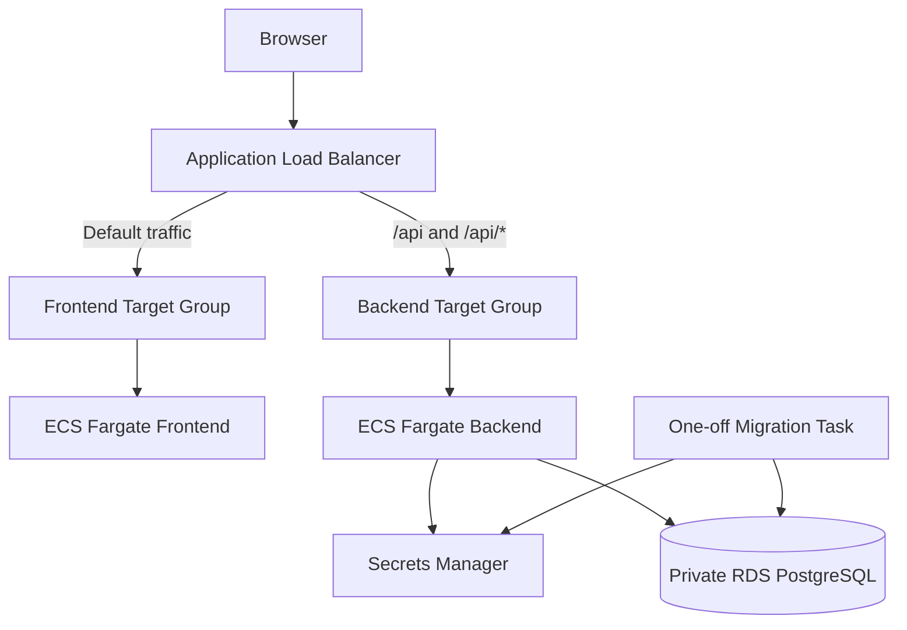
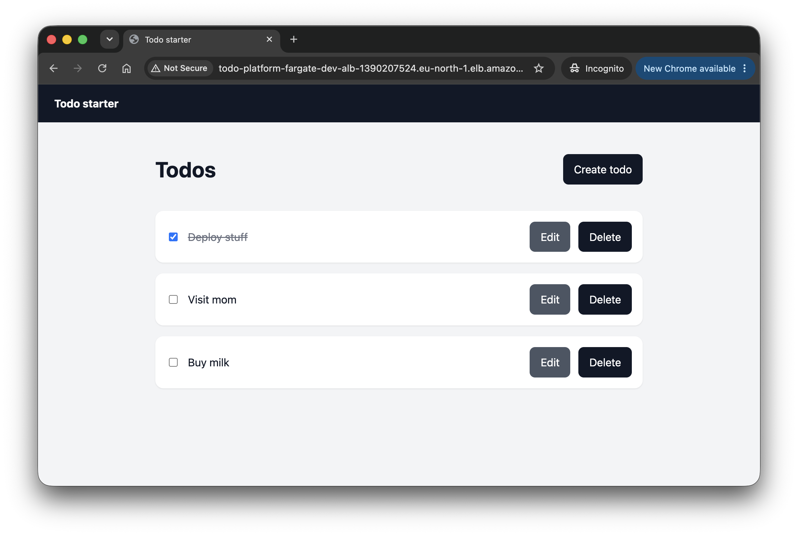

# ECS Fargate Terraform

Terraform for a Todo app on ECS Fargate behind an ALB with a private PostgreSQL RDS database.

## Ownership

- `infra/bootstrap/terraform` owns the shared state bucket protections, GitHub OIDC provider, and global pull-request plan role.
- `infra/ecs-fargate/terraform` owns the environment-specific apply role and all workload infrastructure for this stack.

## Architecture



High level:

- public ALB
- private frontend and backend tasks
- private RDS
- one migration task
- ECR repos for frontend and backend
- CloudWatch log groups

Network rules:

- `0.0.0.0/0 -> ALB :80`
- `ALB -> frontend :80`
- `ALB -> backend :3001`
- `backend -> RDS :5432`

The ECS tasks run in private subnets without public IPs. Outbound access goes through NAT gateways. RDS stays in isolated DB subnets.

## Database

The backend reads DB credentials from Secrets Manager using the backend task role. Terraform does not store a full connection string.

Required ECS env values:

```text
DB_SECRET_ARN
DB_HOST
DB_PORT
DB_NAME
```

## Migrations

Each release can run a one-off migration task before the backend service is updated.

Flow:

```text
Build image -> update migration task definition -> run migration -> verify exit code 0 -> deploy backend
```

## Wrapper

Run the wrapper from the stack directory so `environment` and backend key stay aligned.

```sh
../../scripts/tf-ecs.sh <dev|stage|prod> <terraform-command> [args...]
```

From `infra/ecs-fargate`:

```sh
../../scripts/tf-ecs.sh dev fmt
../../scripts/tf-ecs.sh dev validate
```

## First run

Create ECR first:

```sh
../../scripts/tf-ecs.sh dev apply \
  -target=aws_ecr_repository.frontend \
  -target=aws_ecr_lifecycle_policy.frontend \
  -target=aws_ecr_repository.backend \
  -target=aws_ecr_lifecycle_policy.backend \
  -var frontend_image_tag=bootstrap \
  -var backend_image_tag=bootstrap
```

Read the ECR URLs:

```sh
FRONTEND_REPO="$(terraform -chdir=terraform output -raw frontend_ecr_repository_url)"
BACKEND_REPO="$(terraform -chdir=terraform output -raw backend_ecr_repository_url)"
REGISTRY_HOST="$(printf '%s\n' "$BACKEND_REPO" | cut -d/ -f1)"
```

Log in and push images:

```sh
aws ecr get-login-password --region eu-north-1 \
  | docker login --username AWS --password-stdin "$REGISTRY_HOST"

docker build -f ../../apps/todo/frontend/Dockerfile -t "$FRONTEND_REPO:v1" ../../apps/todo
docker push "$FRONTEND_REPO:v1"

docker build -f ../../apps/todo/backend/Dockerfile -t "$BACKEND_REPO:v1" ../../apps/todo
docker push "$BACKEND_REPO:v1"
```

Create infrastructure with service counts at `0`:

```sh
../../scripts/tf-ecs.sh dev plan \
  -var frontend_image_tag=v1 \
  -var backend_image_tag=v1 \
  -var backend_migration_image_tag=v1 \
  -var frontend_desired_count=0 \
  -var backend_desired_count=0

../../scripts/tf-ecs.sh dev apply \
  -var frontend_image_tag=v1 \
  -var backend_image_tag=v1 \
  -var backend_migration_image_tag=v1 \
  -var frontend_desired_count=0 \
  -var backend_desired_count=0
```

This first local apply also creates the workload's own GitHub Actions apply role.

Run the migration:

```sh
AWS_REGION=eu-north-1 ../../scripts/run-ecs-migration.sh
```

Expected:

```text
Migration succeeded. taskArn=<task-arn> exitCode=0
```

Start the services:

```sh
../../scripts/tf-ecs.sh dev apply \
  -var frontend_image_tag=v1 \
  -var backend_image_tag=v1 \
  -var backend_migration_image_tag=v1 \
  -var frontend_desired_count=1 \
  -var backend_desired_count=1
```

If you only want the infrastructure step in GitHub Actions, keep bootstrap image tags, keep desired counts at `0`, and run `.github/workflows/ecs-fargate-deploy.yml` with `skip_application=true`.

## Later releases

Run the migration with the new backend image before switching the backend service:

```sh
../../scripts/tf-ecs.sh dev apply \
  -var frontend_image_tag=v1 \
  -var backend_image_tag=v1 \
  -var backend_migration_image_tag=v2 \
  -var frontend_desired_count=1 \
  -var backend_desired_count=1

AWS_REGION=eu-north-1 ../../scripts/run-ecs-migration.sh

../../scripts/tf-ecs.sh dev apply \
  -var frontend_image_tag=v1 \
  -var backend_image_tag=v2 \
  -var backend_migration_image_tag=v2 \
  -var frontend_desired_count=1 \
  -var backend_desired_count=1
```

Wait for the backend service if needed:

```sh
aws ecs wait services-stable \
  --region eu-north-1 \
  --cluster "$(terraform -chdir=terraform output -raw ecs_cluster_name)" \
  --services "$(terraform -chdir=terraform output -raw backend_ecs_service_name)"
```

## Verify

```sh
curl "http://$(terraform -chdir=terraform output -raw alb_dns_name)/api/todos"
aws logs tail "/ecs/todo-platform-fargate-dev/backend" --region eu-north-1
```

Expected first API response:

```text
[]
```

Screenshots:

- 
- 

## Notes

- private, Single-AZ RDS
- `multi_az = false`
- `deletion_protection = false`
- `skip_final_snapshot = true`
- ALB uses HTTP only
- NAT gateways and RDS cost money while running

## Destroy

Use the same image tags as the latest apply:

```sh
../../scripts/tf-ecs.sh dev destroy \
  -var frontend_image_tag=v1 \
  -var backend_image_tag=v1 \
  -var backend_migration_image_tag=v1 \
  -var frontend_desired_count=1 \
  -var backend_desired_count=1
```

`force_delete = true` on ECR and `skip_final_snapshot = true` on RDS mean images and DB data can be lost permanently.
