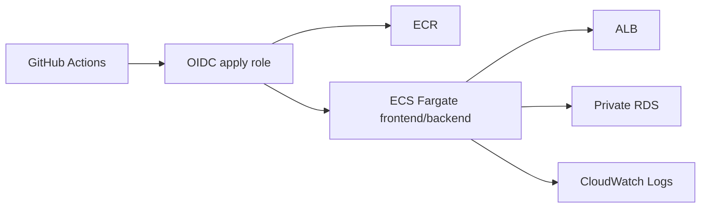

# ECS Fargate Terraform

Shared workload Terraform root for the application stack behind ALB with private RDS. Normal path is GitHub Actions. Local Terraform is mainly for debugging or controlled manual runs.

## Architecture

This diagram shows the normal deploy path and the main workload resources.



## Resources

- VPC, subnets, routing, and security groups
- ALB, listeners, and target groups
- ECS cluster, task definitions, and services
- ECR repositories
- Private PostgreSQL RDS
- CloudWatch log groups
- Workload IAM roles and deploy policy

## Ownership

`infra/bootstrap/terraform` owns:

- state bucket
- GitHub OIDC provider
- global PR plan role
- environment-specific GitHub Actions apply roles

`infra/ecs-fargate/terraform` owns:

- workload resources
- deploy policy for GitHub Actions
- attachment of that deploy policy to the apply role

## Deploy

Normal workflow:

1. Pull requests run Terraform plan through the global plan role.
2. Environment deploys run through the matching GitHub Environment apply role.
3. Workload Terraform manages both infra changes and the deploy-policy attachment it needs.

GitHub Actions entry points:

- PR plan: `.github/workflows/ecs-fargate-pr-check.yml`
- Apply: `.github/workflows/ecs-fargate-deploy.yml`
- Destroy: `.github/workflows/ecs-fargate-destroy.yml`

## Local commands

Run local Terraform only for debugging or a controlled manual run:

```sh
cd infra/ecs-fargate
../../scripts/tf-ecs.sh dev fmt
../../scripts/tf-ecs.sh dev validate
../../scripts/tf-ecs.sh dev plan -var frontend_image_tag=bootstrap -var backend_image_tag=bootstrap
../../scripts/tf-ecs.sh dev apply -var frontend_image_tag=bootstrap -var backend_image_tag=bootstrap
```

## Verify

```sh
terraform -chdir=terraform output -raw alb_dns_name
aws logs tail "/ecs/ecs-fargate-dev/backend" --region eu-north-1
```

## Destroy

Normal destroy path is GitHub Actions with the environment-specific apply role.

Local destroy is possible for controlled teardown:

```sh
cd infra/ecs-fargate
../../scripts/tf-ecs.sh dev destroy -var frontend_image_tag=bootstrap -var backend_image_tag=bootstrap
```
