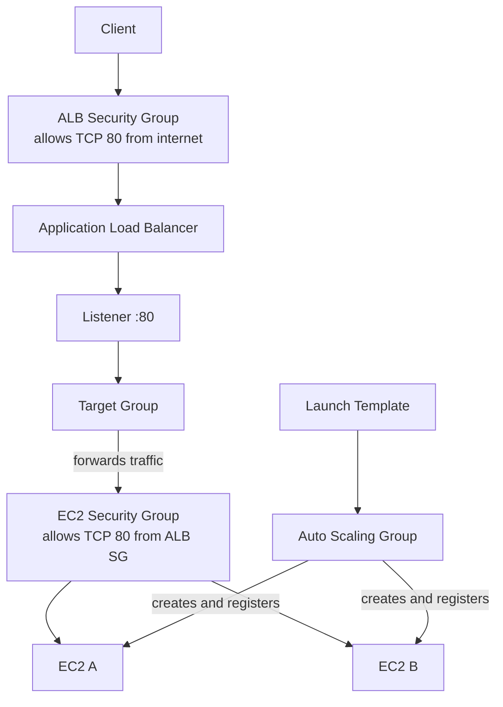
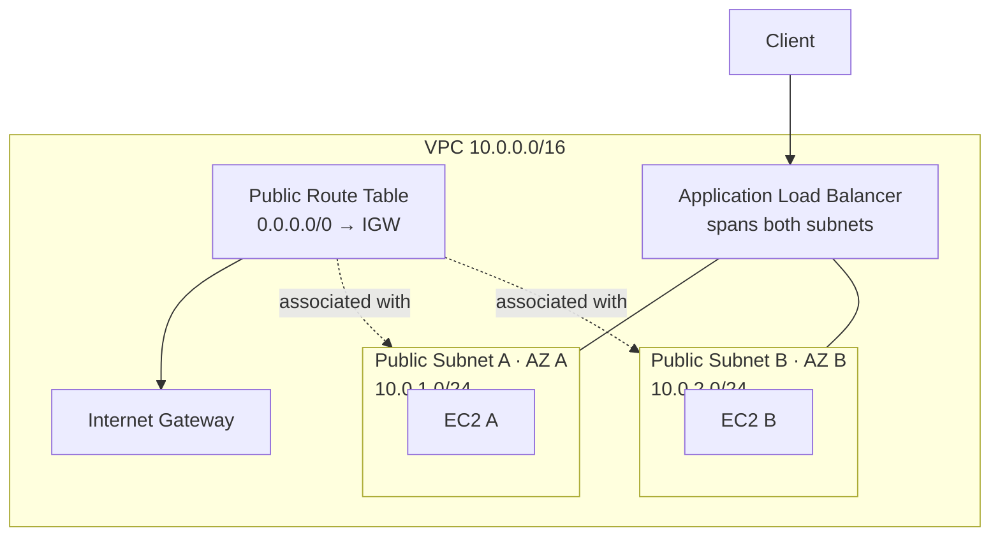

# 07 - ALB Auto Scaling

Basic ALB to Auto Scaling Group flow for Floci.

This is a learning-in-public lab. It is meant to show how the pieces connect, not to present a production-ready Auto Scaling design, and Floci behavior can differ from real AWS.

## Architecture

### Request and provisioning



### Network placement



## Resources

- VPC: `10.0.0.0/16`
- Public subnet A: `10.0.1.0/24`
- Public subnet B: `10.0.2.0/24`
- Internet Gateway and public route table
- Route table associations for both public subnets
- ALB security group
- EC2 security group
- Application Load Balancer
- Target group
- HTTP listener on port `80`
- EC2 Launch Template
- Auto Scaling Group
- Two EC2 instances running a small Python HTTP server

The EC2 instances serve:

```text
hello from 07-alb-autoscaling
```

## Security groups

ALB security group:

```text
0.0.0.0/0 -> TCP 80
```

EC2 security group:

```text
ALB security group -> TCP 80
```

The backend instances only accept HTTP traffic from the ALB security group.

## Auto Scaling configuration

The Auto Scaling Group uses:

```text
minimum capacity: 2
desired capacity: 2
maximum capacity: 4
```

The Launch Template defines how each EC2 instance is created:

- AMI
- Instance type
- EC2 security group
- User data
- Instance tags

The Auto Scaling Group creates instances across the configured subnets and registers them automatically in the target group.

The target group forwards traffic only to instances that pass its health checks.

## Key concepts

- A Launch Template describes how EC2 instances should be created.
- An Auto Scaling Group controls how many instances should exist.
- The desired capacity is the number of instances the group tries to maintain.
- The minimum and maximum capacities define the allowed scaling range.
- The Auto Scaling Group creates EC2 instances in the configured subnets.
- The Auto Scaling Group automatically registers and removes instances from the target group.
- A manual `aws_lb_target_group_attachment` is not needed when the target group is connected directly to the Auto Scaling Group.
- `health_check_type = "ELB"` lets the Auto Scaling Group use load balancer target health when evaluating instances.
- The health check grace period gives new instances time to start before they are evaluated.
- The target group belongs to the VPC, but EC2 registration happens through the Auto Scaling Group.

## What I learned

- How a Launch Template replaces manually defined `aws_instance` resources in an Auto Scaling setup
- How an Auto Scaling Group creates and maintains multiple EC2 instances
- How instances can be distributed across multiple Availability Zones
- How the Auto Scaling Group connects directly to a target group
- Why target group attachments should not be managed manually for ASG instances
- How ALB health checks and Auto Scaling health checks work together
- Why changing a Launch Template does not automatically replace already running instances
- Why recreating or refreshing instances may be required for a new Launch Template version to take effect
- Why subnets determine where instances run, while the target group determines which instances receive traffic

## Commands

Run from this project directory:

```sh
../../tools/tf.sh init
../../tools/tf.sh fmt
../../tools/tf.sh validate
../../tools/tf.sh plan
../../tools/tf.sh apply
```

Apply without confirmation:

```sh
../../tools/tf.sh apply-auto
```

Destroy the lab:

```sh
../../tools/tf.sh destroy
```

## Useful AWS CLI checks

List Auto Scaling Groups:

```sh
aws autoscaling describe-auto-scaling-groups \
  --no-cli-pager
```

List Launch Templates:

```sh
aws ec2 describe-launch-templates \
  --no-cli-pager
```

List EC2 instances:

```sh
aws ec2 describe-instances \
  --no-cli-pager
```

List load balancers:

```sh
aws elbv2 describe-load-balancers \
  --no-cli-pager
```

Check target health:

```sh
aws elbv2 describe-target-health \
  --target-group-arn "<target-group-arn>" \
  --no-cli-pager
```

Expected target state:

```text
healthy
```

## Local Floci verification

List the EC2 containers:

```sh
docker ps
```

Test the web server inside an EC2 container:

```sh
docker exec -it <ec2-container-name> curl http://127.0.0.1:80
```

Expected response:

```text
hello from 07-alb-autoscaling
```

Both instances should eventually appear as healthy targets:

```text
EC2 Instance A -> healthy
EC2 Instance B -> healthy
```

Target registration may initially appear as:

```text
initial
Elb.RegistrationInProgress
```

After the user data starts the HTTP server and the first health checks succeed, the targets become:

```text
healthy
```

After updating the Launch Template or user data, existing Auto Scaling instances may need to be recreated before the change is visible.

## Local Floci note

Floci creates the ALB, Launch Template, Auto Scaling Group, EC2 containers, and target registrations for this lab.

As in the previous ALB lab, the ALB DNS name may not be reachable from the host on port `80` in the local setup.

`*.localhost.floci.io:4566` reaches the Floci edge/API endpoint, not necessarily the ALB listener.

## Real AWS note

This lab uses public subnets and HTTP on port `80` to keep the local setup simple.

In a more typical production design:

- The ALB would use HTTPS with an ACM certificate.
- EC2 instances would usually run in private subnets.
- The Auto Scaling Group would span multiple private subnets and Availability Zones.
- Scaling policies would adjust capacity based on metrics such as CPU usage or request count.
- Instance refreshes would be used to roll out new Launch Template versions.
