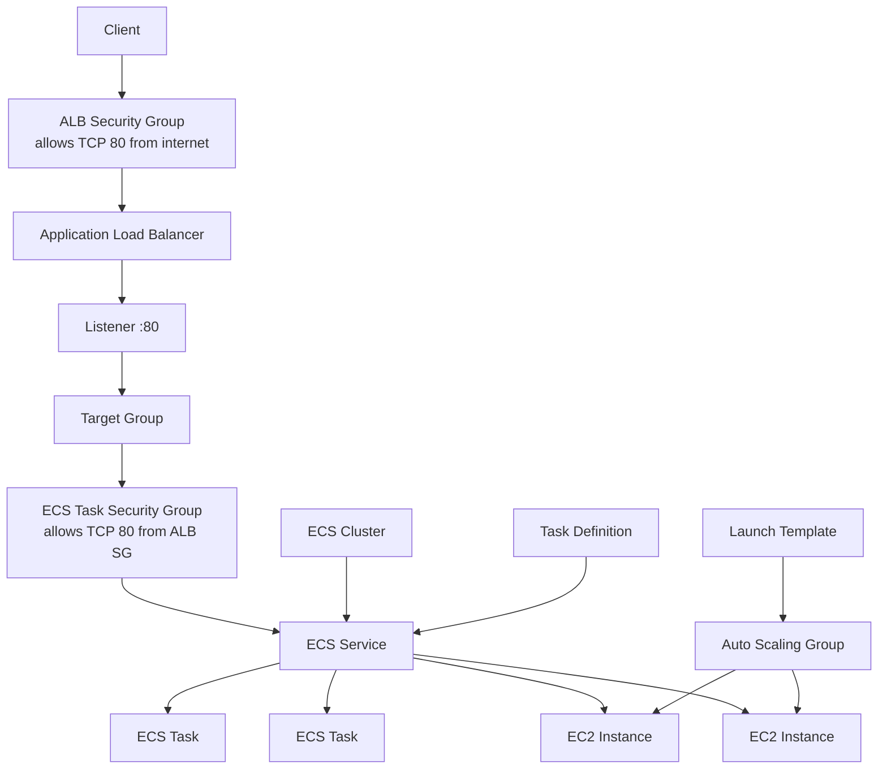
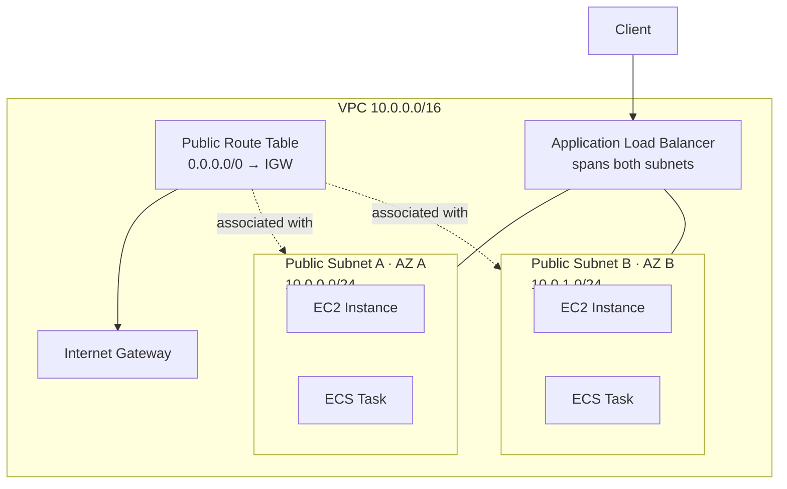

# 09 - ECS EC2 ALB

Basic ECS deployment running on EC2 instances behind an Application Load Balancer using Terraform and Floci.

This is a learning-in-public lab. It is meant to show how ECS, EC2 capacity, Auto Scaling, networking, IAM, and ALB connect together, not to present a production-ready container platform, and Floci behavior can differ from real AWS.

## Architecture

### Request flow



### Network placement



## Resources

- VPC: `10.0.0.0/16`
- Public subnet A: `10.0.0.0/24`
- Public subnet B: `10.0.1.0/24`
- Internet Gateway and public route table
- Route table associations for both public subnets
- ALB security group
- ECS task security group
- Application Load Balancer
- Target group
- HTTP listener on port `80`
- ECS Cluster
- ECS Task Definition
- ECS Service
- Launch Template
- Auto Scaling Group
- IAM execution role
- IAM role and instance profile for ECS container instances
- Two ECS tasks running `nginx:alpine`

The container serves:

```text
Welcome to nginx!
```

## Security groups

ALB security group:

```text
0.0.0.0/0 -> TCP 80
```

ECS task security group:

```text
ALB security group -> TCP 80
```

The ECS tasks only accept HTTP traffic from the ALB security group.

## ECS configuration

The ECS Service uses:

```text
launch type: EC2
network mode: awsvpc
desired tasks: 2
```

The Task Definition defines:

- Container image
- CPU
- Memory
- Container port
- Network mode
- Execution role

The Auto Scaling Group creates EC2 instances from the Launch Template.

Each EC2 instance joins the ECS Cluster through the ECS agent configured in `user_data`.

The ECS Service schedules tasks on the available EC2 capacity and automatically registers them in the target group.

The target group forwards traffic only to healthy tasks.

## Key concepts

- An ECS Cluster is a logical grouping of services and tasks.
- A Task Definition describes how a container should run.
- A Service maintains the desired number of running tasks.
- EC2 provides the compute capacity used by ECS.
- The Auto Scaling Group maintains the desired number of EC2 instances.
- The Launch Template defines how ECS container instances are created.
- `user_data` configures the ECS agent to join the cluster.
- Each task receives its own network interface when using `awsvpc`.
- Tasks register themselves in the target group using their IP address.
- The target group therefore uses `target_type = "ip"` instead of `instance`.
- Security groups control network traffic, while IAM roles control AWS API access.

## What I learned

- The difference between ECS on EC2 and ECS on Fargate
- How ECS schedules tasks onto EC2 instances
- The purpose of Launch Templates
- How Auto Scaling Groups provide ECS capacity
- How EC2 instances join an ECS Cluster
- Why `awsvpc` tasks register IP addresses instead of EC2 instances
- How ALB health checks determine which tasks receive traffic
- The relationship between ECS Cluster, Service, Task Definition, Launch Template, and Auto Scaling Group

## Commands

Run from this project directory:

```sh
../../tools/tf.sh init
../../tools/tf.sh fmt
../../tools/tf.sh validate
../../tools/tf.sh plan
../../tools/tf.sh apply
```

Apply without confirmation:

```sh
../../tools/tf.sh apply-auto
```

Destroy the lab:

```sh
../../tools/tf.sh destroy
```

## Useful AWS CLI checks

List ECS clusters:

```sh
aws ecs list-clusters \
  --no-cli-pager
```

Describe the ECS service:

```sh
aws ecs describe-services \
  --cluster <cluster-name> \
  --services <service-name> \
  --no-cli-pager
```

List running tasks:

```sh
aws ecs list-tasks \
  --cluster <cluster-name> \
  --desired-status RUNNING \
  --no-cli-pager
```

List task definitions:

```sh
aws ecs list-task-definitions \
  --no-cli-pager
```

List load balancers:

```sh
aws elbv2 describe-load-balancers \
  --no-cli-pager
```

Check target health:

```sh
aws elbv2 describe-target-health \
  --target-group-arn "<target-group-arn>" \
  --no-cli-pager
```

Expected target state:

```text
healthy
```

## Local Floci verification

The deployment was verified through the Application Load Balancer:

```text
http://<alb-dns-name>
```

Example:

```text
http://09-ecs-ec2-alb-alb-1129d3e9a1f841e6.elb.localhost.floci.io
```

Expected response:

```text
Welcome to nginx!
```

The target group should report:

```text
healthy
```

This verifies the complete request flow:

```text
Client
→ ALB
→ Listener
→ Target Group
→ ECS Service
→ ECS Tasks
→ nginx
```

## Real AWS note

This lab uses public subnets and HTTP on port `80` to keep the local setup simple.

In a more typical production design:

- The ALB would use HTTPS with an ACM certificate.
- ECS tasks would usually run in private subnets.
- EC2 instances would usually run in private subnets.
- NAT Gateways would provide outbound internet access.
- Container images would typically be stored in Amazon ECR.
- CloudWatch Logs would collect application logs automatically.
- ECS Capacity Providers would commonly be used instead of managing Auto Scaling Groups directly.
- ECS Service Auto Scaling would adjust the desired task count based on metrics such as CPU utilization or request count.
