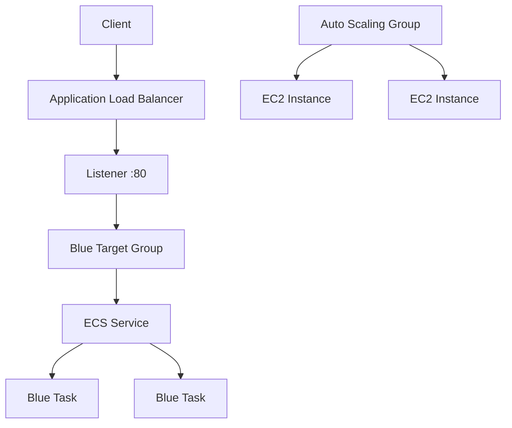
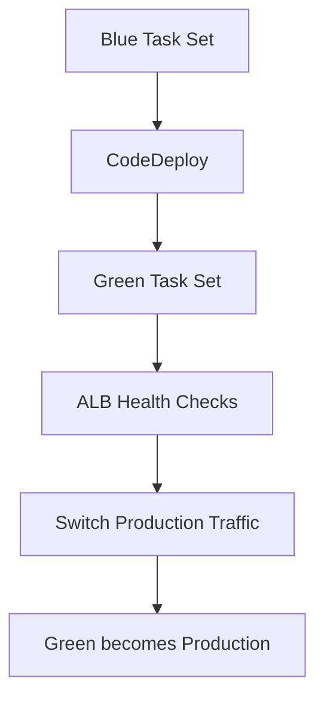

# 16 - ECS Blue/Green

ECS on EC2 with CodeDeploy switching traffic from a blue task set to a green one.

## Architecture





## Resources

- VPC and two public subnets
- Internet Gateway and public route table
- Application Load Balancer
- Blue and green target groups
- ALB security group
- ECS task security group
- ECS Cluster
- ECS Task Definition
- ECS Service
- Launch Template
- Auto Scaling Group
- ECS task execution role
- ECS container instance role
- CodeDeploy service role
- CodeDeploy application and deployment group

The app responds with:

```text
Welcome to nginx!
```

## Notes

- The ECS service uses `deployment_controller = CODE_DEPLOY`.
- Tasks run with `awsvpc`, so both target groups use `target_type = "ip"`.
- CodeDeploy creates the green task set, waits for health checks, then flips traffic.

## What I learned

- How blue/green differs from a normal ECS rolling deployment
- Why ECS blue/green needs two target groups
- How CodeDeploy, ALB health checks, and ECS task sets work together
- Why this was easier to verify through ECS state and target health than through host reachability alone

## Run

```sh
../../tools/tf.sh init
../../tools/tf.sh validate
../../tools/tf.sh plan
../../tools/tf.sh apply
../../tools/tf.sh destroy
```

## Verify

Check the ECS service:

```sh
aws ecs describe-services   --cluster 16-ecs-blue-green-cluster   --services 16-ecs-blue-green-service
```

Check target health:

```sh
aws elbv2 describe-target-health   --target-group-arn <blue-target-group-arn>
```

Direct container check:

```sh
docker exec <task-container> wget -qO- http://127.0.0.1:80
```

Expected:

```text
Welcome to nginx!
```
